# RAG技术全面学习指南

> 本文档详细介绍了16种不同的RAG（检索增强生成）实现方法，包括核心原理、流程图、关键代码和实践建议。

## 📚 目录

- [第一部分：RAG基础概念](#第一部分rag基础概念)
- [第二部分：16种RAG方法详解](#第二部分16种rag方法详解)
  - [1. SimpleRAG - 基础RAG实现](#1-simplerag---基础rag实现)
  - [2. AdaptiveRAG - 自适应查询分类RAG](#2-adaptiverag---自适应查询分类rag)
  - [3. HyDERAG - 假设文档嵌入RAG](#3-hyderag---假设文档嵌入rag)
  - [4. CRAG - 纠正性RAG](#4-crag---纠正性rag)
  - [5. SelfRAG - 自反思RAG](#5-selfrag---自反思rag)
  - [6. RerankRAG - 重排序RAG](#6-rerankrag---重排序rag)
  - [7. FusionRAG - 混合检索RAG](#7-fusionrag---混合检索rag)
  - [8. QueryTransformRAG - 查询转换RAG](#8-querytransformrag---查询转换rag)
  - [9. SemanticRag - 语义分块RAG](#9-semanticrag---语义分块rag)
  - [10. HierarchyRAG - 层次化检索RAG](#10-hierarchyrag---层次化检索rag)
  - [11. ContextualCompressionRAG - 上下文压缩RAG](#11-contextualcompressionrag---上下文压缩rag)
  - [12. ContextEnrichedRAG - 上下文增强RAG](#12-contextenrichedrag---上下文增强rag)
  - [13. ContextualChunkProcessor - 上下文标题RAG](#13-contextualchunkprocessor---上下文标题rag)
  - [14. DocumentAugmentationRAG - 文档增强RAG](#14-documentaugmentationrag---文档增强rag)
  - [15. FeedbackLoopRAG - 反馈循环RAG](#15-feedbacklooprag---反馈循环rag)
  - [16. RSERAG - 相关段落提取RAG](#16-rserag---相关段落提取rag)
- [第三部分：对比分析与选择指南](#第三部分对比分析与选择指南)
- [第四部分：实践建议](#第四部分实践建议)

---

## 第一部分：RAG基础概念

### 什么是RAG？

RAG（Retrieval-Augmented Generation，检索增强生成）是一种结合了信息检索和语言生成的技术架构。它通过在生成回答前先从知识库中检索相关信息，从而使大语言模型能够访问外部知识，提供更准确、更有依据的回答。

### RAG核心组件

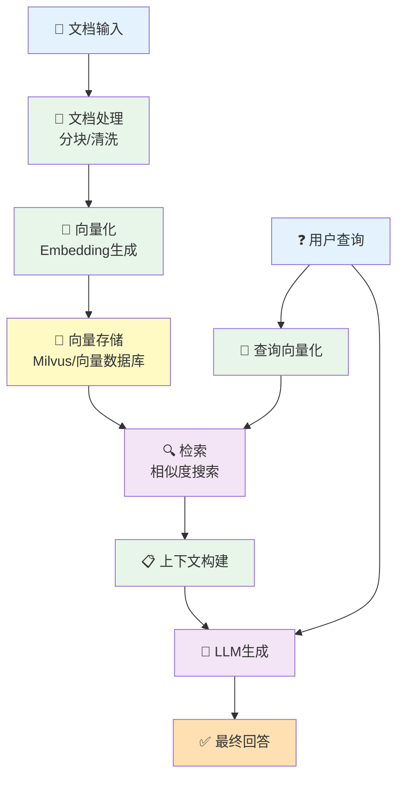

### 基础架构说明

1. **文档处理阶段**：将原始文档分割成合适大小的文本块（chunks）
2. **向量化阶段**：使用Embedding模型将文本转换为高维向量
3. **存储阶段**：将向量和原文存储到向量数据库（如Milvus）
4. **检索阶段**：将用户查询转换为向量，搜索最相似的文本块
5. **生成阶段**：将检索到的上下文和查询一起输入LLM生成答案

### 关键技术点

- **分块策略**：固定大小、重叠分块、语义分块
- **向量模型**：text-embedding-ada-002、BERT、sentence-transformers
- **相似度度量**：余弦相似度、欧氏距离、点积
- **检索策略**：Top-K检索、混合检索、重排序
- **上下文优化**：压缩、扩展、过滤

---

## 第二部分：16种RAG方法详解

### 1. SimpleRAG - 基础RAG实现

#### 📖 方法简介

SimpleRAG是最基础的RAG实现，采用标准的"分块 → 向量化 → 存储 → 检索 → 生成"流程。它使用固定大小的文本分块和重叠策略，通过余弦相似度检索最相关的文本块，然后将这些文本块作为上下文输入到LLM中生成答案。

#### 🎯 核心思想

- **简单直接**：遵循最基本的RAG流程，没有复杂的优化策略
- **固定分块**：使用预定义的chunk_size和overlap参数
- **向量检索**：基于COSINE相似度的语义搜索
- **直接生成**：将检索结果直接作为上下文生成答案

#### 🔄 详细流程图

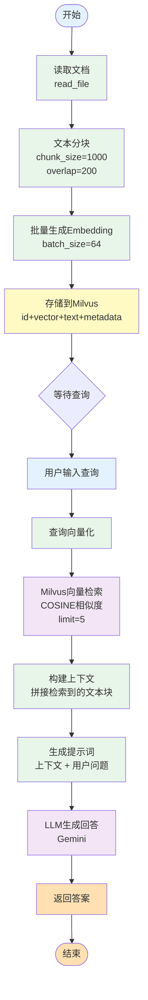

#### 💻 关键代码实现

```python
def chunk_text(self, text: str) -> List[str]:
    """文本分块：使用滑动窗口策略"""
    chunks = []
    step = self.chunk_size - self.overlap  # 计算步长

    for i in range(0, len(text), step):
        chunk = text[i:i + self.chunk_size]
        if chunk.strip():
            chunks.append(chunk)
    return chunks

def process_document(self, file_path: str) -> Dict[str, Any]:
    """处理文档并存储到向量数据库"""
    # 1. 读取文档
    text = self.file_reader.read_file(file_path)

    # 2. 分块处理
    text_chunks = self.chunk_text(text)

    # 3. 批量生成embedding
    embeddings = self._batch_embed_texts(text_chunks)

    # 4. 准备数据并存储到Milvus
    data_to_insert = []
    for i, (chunk, embedding) in enumerate(zip(text_chunks, embeddings)):
        data_to_insert.append({
            "id": self._generate_chunk_id(file_path, i),
            "vector": embedding,
            "text": chunk,
            "source": file_path,
            "chunk_index": i
        })

    # 5. 批量插入
    result = self.milvus_client.insert_data(
        self.collection_name, data_to_insert
    )
    return result

def query(self, question: str, limit: int = 3) -> str:
    """完整查询流程"""
    # 1. 检索相关文本块
    search_results = self.milvus_client.search_by_text(
        collection_name=self.collection_name,
        text=question,
        limit=limit,
        output_fields=["text", "source"],
        metric_type="COSINE",
        embedding_client=self.embedding_client
    )

    # 2. 构建上下文
    context = "\n\n".join([
        f"上下文{i+1}:\n{result['entity']['text']}"
        for i, result in enumerate(search_results)
    ])

    # 3. 生成回答
    user_prompt = f"上下文:\n{context}\n\n用户问题：{question}"
    return self.llm_client.generate_text(
        user_prompt,
        system_instruction=self.system_prompt
    )
```

#### 🔬 算法原理

1. **文本分块算法**：

   - 使用滑动窗口（Sliding Window）方法
   - `step = chunk_size - overlap` 确保相邻块有重叠
   - 重叠部分可以保留上下文连贯性，避免信息断裂
2. **向量相似度计算**：

   - 使用余弦相似度：`cosine_similarity = dot(v1, v2) / (||v1|| * ||v2||)`
   - 值域：[-1, 1]，越接近1表示越相似
   - Milvus自动计算并排序返回Top-K结果
3. **批处理优化**：

   - 将文本块分批处理，每批64个
   - 减少API调用次数，提高处理效率

#### ✅ 优点

- **简单易懂**：实现逻辑清晰，容易理解和维护
- **通用性强**：适用于大多数基础RAG场景
- **性能稳定**：没有复杂逻辑，出错概率低
- **资源高效**：计算开销可预测，易于优化

#### ❌ 缺点

- **固定分块**：无法适应不同类型的文本结构
- **无优化策略**：检索结果质量完全依赖embedding模型
- **上下文限制**：简单拼接可能导致token超限
- **缺乏反馈**：无法根据用户反馈改进

#### 🎯 适用场景

- 简单问答系统
- 文档检索助手
- 知识库查询
- POC验证和快速原型
- 对准确度要求不高的场景

---

### 2. AdaptiveRAG - 自适应查询分类RAG

#### 📖 方法简介

AdaptiveRAG通过分析查询类型，动态选择最适合的检索策略。系统首先使用LLM对用户查询进行分类（事实性、分析性、观点性、上下文相关），然后根据不同类型采用不同的检索和回答策略，从而提供更精准的答案。

#### 🎯 核心思想

- **查询理解**：使用LLM分析查询意图和类型
- **策略适配**：为不同查询类型设计专门的检索策略
- **动态调整**：根据查询特征调整检索参数
- **分类体系**：Factual（事实）、Analytical（分析）、Opinion（观点）、Contextual（上下文）

#### 🔄 详细流程图

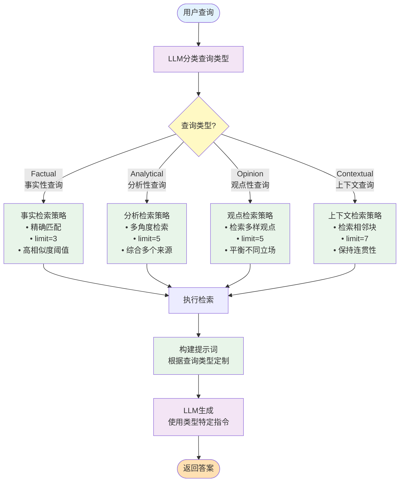

#### 💻 关键代码实现

```python
def _classify_query(self, query: str) -> str:
    """使用LLM对查询进行分类"""
    classification_prompt = """
    请将以下查询分类为以下类型之一：
    - Factual：寻求事实信息的查询
    - Analytical：需要分析、比较或推理的查询
    - Opinion：寻求观点、评价或建议的查询
    - Contextual：需要特定上下文或连续信息的查询

    只返回类型名称，不要解释。

    查询：{query}
    """

    response = self.llm_client.generate_text(
        classification_prompt.format(query=query)
    )
    return response.strip()

def _factual_retrieval_strategy(self, query: str) -> List[Dict]:
    """事实性查询策略：精确检索少量最相关结果"""
    return self.milvus_client.search_by_text(
        collection_name=self.collection_name,
        text=query,
        limit=3,  # 事实查询只需要最相关的几个结果
        output_fields=["text", "source"],
        metric_type="COSINE",
        embedding_client=self.embedding_client
    )

def _analytical_retrieval_strategy(self, query: str) -> List[Dict]:
    """分析性查询策略：检索更多结果以支持分析"""
    return self.milvus_client.search_by_text(
        collection_name=self.collection_name,
        text=query,
        limit=5,  # 分析查询需要更多上下文
        output_fields=["text", "source"],
        metric_type="COSINE",
        embedding_client=self.embedding_client
    )

def _contextual_retrieval_strategy(self, query: str) -> List[Dict]:
    """上下文查询策略：检索连续的文本块"""
    # 1. 先找到最相关的块
    initial_results = self.milvus_client.search_by_text(
        collection_name=self.collection_name,
        text=query,
        limit=3,
        output_fields=["text", "source", "chunk_index"],
        metric_type="COSINE",
        embedding_client=self.embedding_client
    )

    # 2. 获取相邻的块以保持上下文连贯性
    extended_results = []
    for result in initial_results:
        chunk_index = result['entity']['chunk_index']
        source = result['entity']['source']

        # 获取前后各1个块
        for offset in [-1, 0, 1]:
            adjacent_chunk = self.milvus_client.query_data(
                collection_name=self.collection_name,
                filter_expr=f"source == '{source}' && chunk_index == {chunk_index + offset}",
                output_fields=["text", "source", "chunk_index"]
            )
            extended_results.extend(adjacent_chunk)

    return extended_results

def query(self, question: str) -> str:
    """自适应查询主流程"""
    # 1. 分类查询类型
    query_type = self._classify_query(question)

    # 2. 根据类型选择策略
    if query_type == "Factual":
        results = self._factual_retrieval_strategy(question)
        system_instruction = "提供简洁准确的事实性回答。"
    elif query_type == "Analytical":
        results = self._analytical_retrieval_strategy(question)
        system_instruction = "提供深入的分析，考虑多个角度。"
    elif query_type == "Opinion":
        results = self._opinion_retrieval_strategy(question)
        system_instruction = "平衡呈现不同观点。"
    else:  # Contextual
        results = self._contextual_retrieval_strategy(question)
        system_instruction = "基于完整上下文提供连贯的回答。"

    # 3. 构建上下文并生成答案
    context = self._build_context(results)
    return self.llm_client.generate_text(
        f"上下文：\n{context}\n\n问题：{question}",
        system_instruction=system_instruction
    )
```

#### 🔬 算法原理

1. **查询分类算法**：

   - 使用Few-Shot Prompting引导LLM理解分类任务
   - 四个类别基于查询意图和信息需求特征
   - 分类结果直接影响后续检索参数
2. **自适应检索参数**：

   - **Factual**：limit=3，追求精确度
   - **Analytical**：limit=5，需要更全面的信息
   - **Opinion**：limit=5，需要多样性
   - **Contextual**：limit=7（3+相邻块），保持连贯性
3. **上下文扩展策略**：

   - 对于Contextual类型，检索相邻chunk_index的块
   - 通过filter_expr实现精确的相邻块查询

#### ✅ 优点

- **智能适配**：根据查询特点自动调整策略
- **提升准确度**：针对性检索提高答案质量
- **灵活性强**：易于添加新的查询类型和策略
- **用户体验好**：不同类型问题得到更合适的答案

#### ❌ 缺点

- **额外开销**：需要额外的LLM调用进行分类
- **分类准确性**：LLM分类可能出错，影响后续流程
- **复杂度高**：维护多套检索策略增加系统复杂度
- **成本增加**：更多的LLM调用意味着更高的成本

#### 🎯 适用场景

- 多样化查询场景（事实、分析、观点混合）
- 智能问答系统
- 教育辅导系统
- 专业咨询助手
- 需要高质量答案的场景

---

### 3. HyDERAG - 假设文档嵌入RAG

#### 📖 方法简介

HyDE（Hypothetical Document Embeddings）RAG通过让LLM首先生成多个假设性的答案文档，然后使用这些假设文档而非原始查询进行检索。这种方法基于一个洞察：假设答案与真实答案在语义空间中更接近，因此能检索到更相关的文档。

#### 🎯 核心思想

- **假设生成**：LLM生成N个可能的答案文档
- **多样性检索**：每个假设文档独立检索
- **结果聚合**：合并去重所有检索结果
- **二次生成**：基于聚合结果生成最终答案

#### 🔄 详细流程图

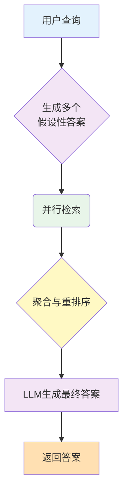

#### 💻 关键代码实现

```python
def generate_hypothetical_documents(
    self, query: str, num_documents: int = 3
) -> List[str]:
    """生成多个假设性答案文档"""
    # 构建提示词，要求生成多个不同角度的答案
    prompt = f"""
    请为以下问题生成{num_documents}个不同的假设性答案。
    每个答案应该从不同角度或使用不同方式回答问题。

    问题：{query}

    请生成{num_documents}个独立的答案，每个答案用"答案N："开头。
    """

    # 使用较高temperature增加多样性
    response = self.llm_client.generate_text(
        prompt,
        temperature=0.8  # 提高随机性
    )

    # 解析生成的假设文档
    hypothetical_docs = []
    for line in response.split('\n'):
        if line.strip().startswith('答案'):
            # 提取答案内容
            doc = line.split('：', 1)[1].strip()
            if doc:
                hypothetical_docs.append(doc)

    return hypothetical_docs[:num_documents]

def search_with_hypothetical_docs(
    self, query: str, num_hypothetical: int = 3, limit: int = 5
) -> List[Dict[str, Any]]:
    """使用假设文档进行检索"""
    # 1. 生成假设文档
    hypothetical_docs = self.generate_hypothetical_documents(
        query, num_hypothetical
    )

    # 2. 对每个假设文档进行检索
    all_results = []
    for i, hypo_doc in enumerate(hypothetical_docs):
        # 使用假设文档作为查询
        results = self.milvus_client.search_by_text(
            collection_name=self.collection_name,
            text=hypo_doc,  # 注意：使用假设文档而非原始查询
            limit=limit,
            output_fields=["text", "source", "chunk_index"],
            metric_type="COSINE",
            embedding_client=self.embedding_client
        )

        # 标记来源于哪个假设文档
        for result in results:
            result['hypothetical_index'] = i

        all_results.extend(results)

    # 3. 聚合和去重
    return self.aggregate_search_results(all_results)

def aggregate_search_results(
    self, results: List[Dict[str, Any]]
) -> List[Dict[str, Any]]:
    """聚合多次检索的结果并去重"""
    # 使用chunk_id作为唯一标识进行去重
    unique_results = {}

    for result in results:
        chunk_id = result.get('id') or result['entity'].get('id')

        if chunk_id not in unique_results:
            # 首次遇到该chunk，记录分数
            unique_results[chunk_id] = {
                'result': result,
                'scores': [result.get('score', 1 - result.get('distance', 0))],
                'count': 1
            }
        else:
            # 已存在该chunk，累加分数
            unique_results[chunk_id]['scores'].append(
                result.get('score', 1 - result.get('distance', 0))
            )
            unique_results[chunk_id]['count'] += 1

    # 计算聚合分数（平均分 + 出现次数加权）
    aggregated = []
    for chunk_id, data in unique_results.items():
        avg_score = sum(data['scores']) / len(data['scores'])
        # 出现次数越多，分数略微提升
        boosted_score = avg_score * (1 + 0.1 * (data['count'] - 1))

        result = data['result']
        result['aggregated_score'] = boosted_score
        result['appearance_count'] = data['count']
        aggregated.append(result)

    # 按聚合分数排序
    aggregated.sort(key=lambda x: x['aggregated_score'], reverse=True)
    return aggregated

def query(self, question: str, num_hypothetical: int = 3, limit: int = 5) -> str:
    """完整的HyDE RAG流程"""
    # 1. 使用假设文档检索
    search_results = self.search_with_hypothetical_docs(
        question, num_hypothetical, limit
    )

    # 2. 构建上下文
    context = "\n\n".join([
        f"文档{i+1} (相关度:{result['aggregated_score']:.3f}, 出现{result['appearance_count']}次):\n{result['entity']['text']}"
        for i, result in enumerate(search_results[:limit])
    ])

    # 3. 使用真实检索到的文档生成最终答案
    final_prompt = f"上下文:\n{context}\n\n问题: {question}"
    return self.llm_client.generate_text(
        final_prompt,
        system_instruction=self.system_prompt
    )
```

#### 🔬 算法原理

1. **假设文档生成理论**：

   - 查询Q和答案A在embedding空间中距离较远
   - 假设答案H与真实答案A在embedding空间中距离较近
   - 使用H检索比使用Q更容易找到A
2. **多样性增强**：

   - 使用 `temperature=0.8`增加生成多样性
   - 生成多个角度的假设答案覆盖更广的语义空间
   - 每个假设文档独立检索避免bias
3. **结果聚合算法**：

   ```
   aggregated_score = avg_score * (1 + 0.1 * (appearance_count - 1))
   ```

   - 基础分数：多次检索的平均相似度
   - 频次加权：出现多次的文档略微提升分数
   - 最终排序：综合考虑相关性和稳定性

#### ✅ 优点

- **提升召回率**：假设文档与答案语义更接近，检索更准确
- **覆盖面广**：多个假设文档从不同角度检索
- **鲁棒性强**：即使某个假设不准确，其他假设可以补偿
- **适合复杂查询**：对于抽象或复杂问题效果更好

#### ❌ 缺点

- **高计算成本**：需要额外生成N个假设文档
- **延迟增加**：多次LLM调用和多次检索增加响应时间
- **可能偏离**：假设文档可能引入错误方向
- **资源消耗大**：embedding和检索次数成倍增加

#### 🎯 适用场景

- 复杂或抽象的查询
- 领域专业问题
- 需要高召回率的场景
- 用户查询表达不清晰时
- 对响应时间要求不苛刻的场景

---

### 4. CRAG - 纠正性RAG

#### 📖 方法简介

CRAG（Corrective RAG）通过评估检索文档的相关性，动态决定是否需要外部网络搜索来补充或替换检索结果。系统会计算每个文档的相关性分数，根据阈值决定采用本地文档、网络搜索还是混合策略，从而提供更可靠的答案。

#### 🎯 核心思想

- **相关性评估**：使用LLM评估每个检索文档的相关性（0-1分）
- **动态决策**：根据相关性分数决定信息来源
- **三种策略**：纯本地、纯网络、混合检索
- **知识精炼**：过滤低质量文档，提取关键信息

#### 🔄 详细流程图

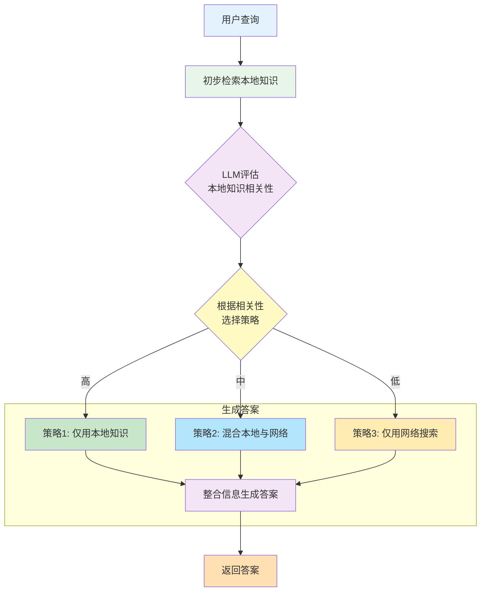

#### 💻 关键代码实现

```python
def evaluate_document_relevance(
    self, query: str, document: str
) -> float:
    """评估单个文档与查询的相关性（0-1分数）"""
    eval_prompt = f"""
    评估以下文档对回答查询的相关性。

    查询：{query}

    文档：{document[:500]}...

    请给出0到1之间的相关性分数：
    - 0.0: 完全不相关
    - 0.3: 弱相关
    - 0.5: 中等相关
    - 0.7: 高度相关
    - 1.0: 完全相关

    只返回数字分数，不要解释。
    """

    try:
        response = self.llm_client.generate_text(eval_prompt)
        score = float(response.strip())
        return max(0.0, min(1.0, score))  # 确保在[0,1]范围内
    except:
        return 0.5  # 默认中等相关

def rewrite_search_query(self, original_query: str) -> str:
    """重写查询以进行网络搜索"""
    rewrite_prompt = f"""
    将以下查询改写为更适合网络搜索的形式。
    使其更简洁、关键词明确、易于检索。

    原始查询：{original_query}

    改写后的查询：
    """
    return self.llm_client.generate_text(rewrite_prompt).strip()

def perform_web_search(self, query: str, limit: int = 3) -> List[str]:
    """执行网络搜索（模拟）"""
    # 实际应用中，这里会调用真实的搜索API（如Google、Bing）
    # 这里简化为返回示例
    return [
        f"网络搜索结果{i+1}，关于：{query}"
        for i in range(limit)
    ]

def refine_knowledge(
    self, query: str, documents: List[str]
) -> List[str]:
    """从文档中精炼提取关键知识"""
    refined = []
    for doc in documents:
        refine_prompt = f"""
        从以下文档中提取与查询最相关的关键信息。
        只保留直接相关的内容，删除无关信息。

        查询：{query}
        文档：{doc}

        关键信息：
        """

        key_info = self.llm_client.generate_text(refine_prompt)
        if key_info.strip():
            refined.append(key_info.strip())

    return refined

def crag_process(
    self, query: str,
    relevance_threshold_high: float = 0.7,
    relevance_threshold_low: float = 0.3
) -> Dict[str, Any]:
    """完整的CRAG流程"""
    # 1. 初始检索
    search_results = self.milvus_client.search_by_text(
        collection_name=self.collection_name,
        text=query,
        limit=5,
        output_fields=["text"],
        metric_type="COSINE",
        embedding_client=self.embedding_client
    )

    # 2. 评估每个文档的相关性
    relevance_scores = []
    documents = []
    for result in search_results:
        doc_text = result['entity']['text']
        documents.append(doc_text)
        score = self.evaluate_document_relevance(query, doc_text)
        relevance_scores.append(score)

    # 3. 计算平均相关性
    avg_relevance = sum(relevance_scores) / len(relevance_scores) if relevance_scores else 0

    # 4. 根据平均相关性决定策略
    if avg_relevance >= relevance_threshold_high:
        # 策略1：高相关性，使用本地文档
        strategy = "LOCAL"
        # 过滤低分文档
        filtered_docs = [
            doc for doc, score in zip(documents, relevance_scores)
            if score >= 0.5
        ]
        knowledge_base = self.refine_knowledge(query, filtered_docs)

    elif avg_relevance <= relevance_threshold_low:
        # 策略2：低相关性，使用网络搜索
        strategy = "WEB"
        rewritten_query = self.rewrite_search_query(query)
        web_results = self.perform_web_search(rewritten_query)
        knowledge_base = self.refine_knowledge(query, web_results)

    else:
        # 策略3：中等相关性，混合使用
        strategy = "HYBRID"
        # 保留部分本地文档
        local_docs = [
            doc for doc, score in zip(documents, relevance_scores)
            if score >= 0.4
        ]
        # 补充网络搜索
        rewritten_query = self.rewrite_search_query(query)
        web_results = self.perform_web_search(rewritten_query, limit=2)

        combined_docs = local_docs + web_results
        knowledge_base = self.refine_knowledge(query, combined_docs)

    # 5. 生成最终答案
    context = "\n\n".join(knowledge_base)
    answer = self.llm_client.generate_text(
        f"上下文:\n{context}\n\n问题: {query}",
        system_instruction=self.system_prompt
    )

    return {
        "query": query,
        "strategy": strategy,
        "avg_relevance": avg_relevance,
        "knowledge_sources": len(knowledge_base),
        "answer": answer
    }
```

#### 🔬 算法原理

1. **相关性评估算法**：

   - 使用LLM作为评分器（0-1分数）
   - 评估文档内容与查询的语义匹配度
   - 比简单的向量相似度更智能
2. **决策树逻辑**：

   ```
   if avg_score > 0.7:
       strategy = LOCAL  # 本地文档质量高
   elif avg_score < 0.3:
       strategy = WEB    # 本地文档不相关，需要网络搜索
   else:
       strategy = HYBRID # 需要补充信息
   ```
3. **知识精炼**：

   - 使用LLM提取文档中与查询直接相关的部分
   - 减少噪声，提高上下文质量
   - 类似于extractive summarization
4. **查询重写**：

   - 将对话式查询转换为搜索引擎友好格式
   - 提取关键词，增强检索效果

#### ✅ 优点

- **自适应决策**：根据检索质量动态调整策略
- **结果可靠**：低质量检索时自动寻找外部信息
- **知识精炼**：过滤噪声，提高上下文质量
- **透明度高**：明确标识使用的策略和信息来源

#### ❌ 缺点

- **成本高昂**：每个文档都需要LLM评估
- **依赖外部**：网络搜索需要额外API和成本
- **延迟增加**：多次LLM调用和可能的网络搜索
- **复杂度高**：需要维护多个数据源和策略

#### 🎯 适用场景

- 知识库可能不完整的场景
- 需要最新信息的应用（新闻、时事）
- 高准确度要求的专业领域
- 混合内外部知识源的系统
- 对错误容忍度低的场景

---

### 5. SelfRAG - 自反思RAG

#### 📖 方法简介

SelfRAG通过在检索和生成的每个关键步骤进行自我反思和评估，确保答案的质量。系统会判断是否需要检索、评估检索文档的相关性、验证答案是否有文档支持，以及评估答案的实用性，形成一个完整的自我纠正循环。

#### 🎯 核心思想

- **检索必要性判断**：先判断是否需要检索外部知识
- **相关性评估**：评估检索文档是否真正相关
- **支持度验证**：检查生成的答案是否有文档支持
- **效用评分**：评估答案对用户的实用程度
- **四重评估**：多层次quality gate确保质量

#### 🔄 详细流程图

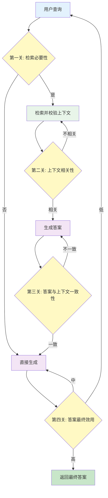

#### 💻 关键代码实现

```python
def determine_if_retrieval(self, query: str) -> str:
    """判断是否需要检索外部知识"""
    prompt = f"""
    判断回答以下问题是否需要检索外部知识：

    问题：{query}

    如果问题是：
    - 事实性问题、需要具体数据 → 返回 RETRIEVE
    - 常识性问题、可直接回答 → 返回 NO_RETRIEVE

    只返回 RETRIEVE 或 NO_RETRIEVE。
    """

    response = self.llm_client.generate_text(prompt)
    return "RETRIEVE" if "RETRIEVE" in response else "NO_RETRIEVE"

def evaluate_relevance(self, query: str, documents: List[str]) -> List[str]:
    """评估每个文档的相关性"""
    relevance_labels = []

    for doc in documents:
        prompt = f"""
        评估文档与查询的相关性：

        查询：{query}
        文档：{doc[:300]}...

        返回以下之一：
        - RELEVANT：文档直接相关，包含回答所需信息
        - PARTIALLY_RELEVANT：文档部分相关
        - IRRELEVANT：文档不相关
        """

        response = self.llm_client.generate_text(prompt)
        if "RELEVANT" in response and "PARTIALLY" not in response:
            label = "RELEVANT"
        elif "PARTIALLY" in response:
            label = "PARTIALLY_RELEVANT"
        else:
            label = "IRRELEVANT"

        relevance_labels.append(label)

    return relevance_labels

def assess_support(self, answer: str, documents: List[str]) -> str:
    """评估答案是否有文档支持"""
    docs_text = "\n\n".join(documents)

    prompt = f"""
    检查答案是否有文档支持：

    答案：{answer}

    文档：{docs_text[:1000]}...

    返回以下之一：
    - FULLY_SUPPORTED：答案中的所有陈述都有文档支持
    - PARTIALLY_SUPPORTED：部分陈述有支持
    - NOT_SUPPORTED：答案没有文档支持或与文档矛盾
    """

    response = self.llm_client.generate_text(prompt)
    if "FULLY_SUPPORTED" in response:
        return "FULLY_SUPPORTED"
    elif "PARTIALLY" in response:
        return "PARTIALLY_SUPPORTED"
    else:
        return "NOT_SUPPORTED"

def rate_utility(self, query: str, answer: str) -> int:
    """评估答案的实用性（1-5分）"""
    prompt = f"""
    评估答案对用户的实用性：

    问题：{query}
    答案：{answer}

    评分标准（1-5分）：
    5分：完整、准确、直接回答问题，非常有用
    4分：回答准确，信息充分
    3分：基本回答问题，但不够详细
    2分：部分回答或信息不足
    1分：未能回答问题或信息错误

    只返回1-5的数字。
    """

    try:
        response = self.llm_client.generate_text(prompt)
        score = int(response.strip())
        return max(1, min(5, score))
    except:
        return 3  # 默认中等效用

def self_rag(
    self,
    query: str,
    max_iterations: int = 2
) -> Dict[str, Any]:
    """完整的Self-RAG流程"""
    iteration = 0

    while iteration < max_iterations:
        # 步骤1：判断是否需要检索
        retrieval_decision = self.determine_if_retrieval(query)

        if retrieval_decision == "RETRIEVE":
            # 执行检索
            search_results = self.milvus_client.search_by_text(
                collection_name=self.collection_name,
                text=query,
                limit=5,
                output_fields=["text"],
                metric_type="COSINE",
                embedding_client=self.embedding_client
            )

            documents = [r['entity']['text'] for r in search_results]

            # 步骤2：评估相关性
            relevance_labels = self.evaluate_relevance(query, documents)

            # 过滤出相关文档
            relevant_docs = [
                doc for doc, label in zip(documents, relevance_labels)
                if label in ["RELEVANT", "PARTIALLY_RELEVANT"]
            ]

            if not relevant_docs:
                # 没有相关文档，使用模型知识
                context = ""
            else:
                context = "\n\n".join(relevant_docs)

        else:
            # 不需要检索，直接生成
            documents = []
            context = ""

        # 生成答案
        if context:
            prompt = f"上下文:\n{context}\n\n问题: {query}"
        else:
            prompt = query

        answer = self.llm_client.generate_text(
            prompt,
            system_instruction=self.system_prompt
        )

        # 步骤3：评估支持度（仅当使用了文档时）
        if documents:
            support_label = self.assess_support(answer, relevant_docs if context else [])

            if support_label == "NOT_SUPPORTED":
                iteration += 1
                continue  # 重新生成
            elif support_label == "PARTIALLY_SUPPORTED":
                # 添加不确定性说明
                answer = f"{answer}\n\n注：部分信息可能需要进一步验证。"
        else:
            support_label = "NO_RETRIEVAL"

        # 步骤4：评估效用
        utility_score = self.rate_utility(query, answer)

        if utility_score >= 3:
            # 效用足够，返回答案
            return {
                "query": query,
                "answer": answer,
                "retrieval_used": retrieval_decision == "RETRIEVE",
                "documents_count": len(documents),
                "relevant_docs_count": len(relevant_docs) if documents else 0,
                "support_level": support_label,
                "utility_score": utility_score,
                "iterations": iteration + 1
            }

        # 效用不足，重试
        iteration += 1

    # 达到最大迭代次数，返回当前最佳答案
    return {
        "query": query,
        "answer": answer,
        "retrieval_used": retrieval_decision == "RETRIEVE",
        "support_level": support_label if documents else "NO_RETRIEVAL",
        "utility_score": utility_score,
        "iterations": max_iterations,
        "warning": "达到最大迭代次数"
    }
```

#### 🔬 算法原理

1. **四重评估机制**：

   - **Retrieval Necessity**：避免不必要的检索
   - **Relevance**：确保检索质量
   - **Support**：验证答案真实性
   - **Utility**：评估用户满意度
2. **迭代优化**：

   ```python
   while utility_score < threshold and iterations < max:
       # 重新生成或调整策略
       iterations += 1
   ```

   - 最多迭代N次尝试优化答案
   - 避免无限循环设置max_iterations
3. **分级判断**：

   - RELEVANT/PARTIALLY_RELEVANT/IRRELEVANT
   - FULLY_SUPPORTED/PARTIALLY_SUPPORTED/NOT_SUPPORTED
   - 1-5分效用评分
   - 提供细粒度的质量控制

#### ✅ 优点

- **质量保证**：多层评估确保高质量输出
- **自我纠正**：发现问题自动重试
- **透明度高**：提供详细的评估信息
- **减少幻觉**：严格验证答案支持度
- **自适应**：根据问题特点调整策略

#### ❌ 缺点

- **极高成本**：多次LLM评估调用
- **延迟显著**：多轮评估和可能的迭代
- **复杂度高**：实现和调试困难
- **评估可能不准**：LLM自评不一定可靠
- **资源密集**：不适合高并发场景

#### 🎯 适用场景

- 高准确度要求（医疗、法律、金融）
- 对错误零容忍的场景
- 需要可解释性的应用
- 内容审核和质量控制
- 专业领域知识问答
- 对成本和延迟不敏感的场景

---

### 6. RerankRAG - 重排序RAG

#### 📖 方法简介

RerankRAG采用两阶段检索策略：首先使用向量相似度进行粗检索获取较多候选文档，然后使用专门的Rerank模型对候选结果进行精细排序，最终选择Top-K最相关的文档。这种方法平衡了检索效率和准确性。

#### 🎯 核心思想

- **两阶段检索**：粗检索（向量） + 精排序（Rerank模型）
- **候选扩展**：初检索获取更多候选（limit * 2）
- **精细排序**：使用Cross-Encoder或专门rerank模型
- **质量提升**：Rerank模型考虑query-document交互

#### 🔄 详细流程图

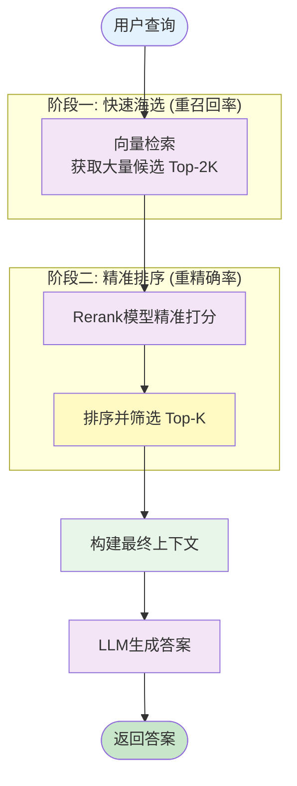

#### 💻 关键代码实现

```python
def search_and_rerank(
    self,
    query: str,
    limit: int = 5,
    rerank_multiplier: int = 2
) -> List[Dict[str, Any]]:
    """两阶段检索：向量检索 + Rerank"""

    # 阶段1：粗检索 - 获取更多候选
    initial_limit = limit * rerank_multiplier  # 例如：需要5个，先取10个

    search_results = self.milvus_client.search_by_text(
        collection_name=self.collection_name,
        text=query,
        limit=initial_limit,  # 扩大候选池
        output_fields=["text", "source", "chunk_index"],
        metric_type="COSINE",
        embedding_client=self.embedding_client
    )

    if not search_results:
        return []

    # 提取文档文本
    documents = [
        result['entity']['text']
        for result in search_results
    ]

    # 阶段2：精排序
    reranked_results = self._rerank_documents(query, search_results, documents)

    # 返回Top-K
    return reranked_results[:limit]

def _rerank_documents(
    self,
    query: str,
    search_results: List[Dict],
    documents: List[str]
) -> List[Dict[str, Any]]:
    """使用Rerank模型重新排序"""

    # 方法1：使用专门的Rerank模型（如Cohere Rerank, jina-reranker）
    # 这里使用LLM模拟rerank（实际应用中应使用专门模型）

    rerank_scores = []
    for doc in documents:
        # 使用LLM评估查询-文档相关性
        score = self._compute_rerank_score(query, doc)
        rerank_scores.append(score)

    # 将rerank分数添加到结果中
    for result, score in zip(search_results, rerank_scores):
        result['rerank_score'] = score
        # 保留原始向量相似度分数
        result['vector_score'] = result.get('score', 1 - result.get('distance', 0))

    # 按rerank分数排序
    reranked = sorted(
        search_results,
        key=lambda x: x['rerank_score'],
        reverse=True
    )

    return reranked

def _compute_rerank_score(self, query: str, document: str) -> float:
    """计算rerank分数（实际应使用Cross-Encoder模型）"""
    # 实际应用中应使用：
    # - sentence-transformers的Cross-Encoder
    # - Cohere Rerank API
    # - jina-reranker
    # - ms-marco-MiniLM-L-12-v2

    # 这里用LLM模拟（仅为示例）
    prompt = f"""
    评估文档与查询的相关性（0-100分）：

    查询：{query}
    文档：{document[:500]}

    考虑：
    - 语义匹配程度
    - 信息完整性
    - 回答问题的直接程度

    只返回0-100的整数分数。
    """

    try:
        response = self.llm_client.generate_text(prompt)
        score = float(response.strip())
        return max(0.0, min(100.0, score)) / 100.0
    except:
        return 0.5

# 实际生产环境的Rerank实现示例：
def _rerank_with_cross_encoder(
    self,
    query: str,
    documents: List[str]
) -> List[float]:
    """使用Cross-Encoder模型进行rerank（生产环境推荐）"""
    # 示例：使用sentence-transformers的Cross-Encoder
    """
    from sentence_transformers import CrossEncoder

    model = CrossEncoder('cross-encoder/ms-marco-MiniLM-L-12-v2')

    # 准备query-document对
    pairs = [[query, doc] for doc in documents]

    # 批量计算分数
    scores = model.predict(pairs)

    return scores.tolist()
    """
    pass

def query(self, question: str, limit: int = 3) -> str:
    """完整的Rerank RAG查询流程"""
    # 1. 两阶段检索
    reranked_results = self.search_and_rerank(question, limit)

    if not reranked_results:
        return "未找到相关信息。"

    # 2. 构建上下文（使用rerank后的结果）
    context_parts = []
    for i, result in enumerate(reranked_results):
        text = result['entity']['text']
        rerank_score = result['rerank_score']
        vector_score = result['vector_score']

        context_parts.append(
            f"文档{i+1} [向量分数:{vector_score:.3f}, Rerank分数:{rerank_score:.3f}]:\n{text}"
        )

    context = "\n\n".join(context_parts)

    # 3. 生成答案
    return self.llm_client.generate_text(
        f"上下文:\n{context}\n\n问题: {question}",
        system_instruction=self.system_prompt
    )
```

#### 🔬 算法原理

1. **两阶段检索理论**：

   - **第一阶段（Recall）**：向量检索快速但不够精确，用于召回
   - **第二阶段（Precision）**：Rerank模型慢但精确，用于精排
   - 结合两者优势：效率 + 准确性
2. **Cross-Encoder vs Bi-Encoder**：

   - **Bi-Encoder**（向量检索）：

     ```
     encode(query) ⊗ encode(doc)
     独立编码，快速但信息损失
     ```
   - **Cross-Encoder**（Rerank）：

     ```
     encode(query + doc together)
     联合编码，慢但更准确
     ```
3. **候选扩展策略**：

   ```python
   initial_limit = target_limit * multiplier
   # multiplier通常为2-3
   # 平衡召回率和计算成本
   ```
4. **分数融合（可选）**：

   ```python
   final_score = α * vector_score + β * rerank_score
   # α + β = 1
   # 或者只用rerank_score
   ```

#### ✅ 优点

- **提升准确性**：Rerank显著提高Top-K质量
- **保持效率**：向量检索快速筛选候选
- **灵活性强**：可以轻松更换rerank模型
- **效果显著**：通常提升10-20%的准确率
- **即插即用**：容易集成到现有系统

#### ❌ 缺点

- **额外计算**：Rerank增加计算开销
- **延迟增加**：两阶段处理增加响应时间
- **模型依赖**：需要额外的Rerank模型
- **内存占用**：需要加载额外模型
- **成本上升**：API调用或GPU资源

#### 🎯 适用场景

- 对检索准确度要求高的场景
- 可以容忍轻微延迟增加
- 有计算资源支持Rerank模型
- 需要提升Top-K结果质量
- 通用RAG系统的升级方案
- 搜索引擎和推荐系统

---

### 7. FusionRAG - 混合检索RAG

#### 📖 方法简介

FusionRAG结合了稀疏检索（BM25）和密集检索（向量相似度）两种方法，使用倒数排名融合（Reciprocal Rank Fusion, RRF）算法合并两种检索结果。BM25擅长精确关键词匹配，向量检索擅长语义理解，两者互补可以显著提升检索质量。

#### 🎯 核心思想

- **双路检索**：BM25稀疏检索 + 向量密集检索
- **优势互补**：关键词精确匹配 + 语义理解
- **RRF融合**：基于排名的公平融合算法
- **鲁棒性强**：单一方法失效时另一个可补偿

#### 🔄 详细流程图

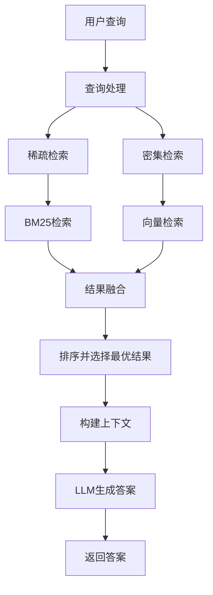

#### 💻 关键代码实现

```python
from rank_bm25 import BM25Okapi
import numpy as np

def create_bm25_index(self, documents: List[str]) -> BM25Okapi:
    """创建BM25索引"""
    # 分词（中文需要jieba等分词工具）
    tokenized_corpus = [doc.split() for doc in documents]

    # 创建BM25索引
    bm25 = BM25Okapi(tokenized_corpus)

    return bm25

def bm25_search(
    self,
    query: str,
    bm25_index: BM25Okapi,
    documents: List[str],
    limit: int = 10
) -> List[Dict[str, Any]]:
    """执行BM25检索"""
    # 查询分词
    tokenized_query = query.split()

    # 计算BM25分数
    scores = bm25_index.get_scores(tokenized_query)

    # 获取Top-K索引
    top_indices = np.argsort(scores)[::-1][:limit]

    # 构建结果
    results = []
    for rank, idx in enumerate(top_indices):
        results.append({
            'doc_id': idx,
            'text': documents[idx],
            'bm25_score': float(scores[idx]),
            'bm25_rank': rank + 1
        })

    return results

def vector_search(
    self,
    query: str,
    limit: int = 10
) -> List[Dict[str, Any]]:
    """执行向量检索"""
    results = self.milvus_client.search_by_text(
        collection_name=self.collection_name,
        text=query,
        limit=limit,
        output_fields=["text", "source", "chunk_index"],
        metric_type="COSINE",
        embedding_client=self.embedding_client
    )

    # 添加排名信息
    for rank, result in enumerate(results):
        result['vector_rank'] = rank + 1
        result['vector_score'] = result.get('score', 1 - result.get('distance', 0))

    return results

def reciprocal_rank_fusion(
    self,
    bm25_results: List[Dict],
    vector_results: List[Dict],
    k: int = 60  # RRF常数，通常取60
) -> List[Dict[str, Any]]:
    """倒数排名融合算法"""
    # 创建文档ID到融合分数的映射
    fusion_scores = {}

    # 处理BM25结果
    for result in bm25_results:
        doc_id = result.get('doc_id') or result.get('id')
        rank = result['bm25_rank']

        # RRF公式：score = 1 / (k + rank)
        rrf_score = 1.0 / (k + rank)

        if doc_id not in fusion_scores:
            fusion_scores[doc_id] = {
                'doc_id': doc_id,
                'text': result['text'],
                'rrf_score': 0.0,
                'bm25_rank': rank,
                'vector_rank': None,
                'bm25_score': result.get('bm25_score'),
                'vector_score': None
            }

        fusion_scores[doc_id]['rrf_score'] += rrf_score

    # 处理向量检索结果
    for result in vector_results:
        doc_id = result.get('id') or result['entity'].get('id')
        rank = result['vector_rank']

        rrf_score = 1.0 / (k + rank)

        if doc_id not in fusion_scores:
            fusion_scores[doc_id] = {
                'doc_id': doc_id,
                'text': result['entity']['text'],
                'rrf_score': 0.0,
                'bm25_rank': None,
                'vector_rank': rank,
                'bm25_score': None,
                'vector_score': result['vector_score']
            }
        else:
            fusion_scores[doc_id]['vector_rank'] = rank
            fusion_scores[doc_id]['vector_score'] = result['vector_score']

        fusion_scores[doc_id]['rrf_score'] += rrf_score

    # 转换为列表并排序
    fused_results = list(fusion_scores.values())
    fused_results.sort(key=lambda x: x['rrf_score'], reverse=True)

    return fused_results

def fusion_search(
    self,
    query: str,
    limit: int = 5,
    bm25_limit: int = 10,
    vector_limit: int = 10
) -> List[Dict[str, Any]]:
    """混合检索：BM25 + 向量 + RRF融合"""

    # 1. 获取所有文档（用于BM25）
    all_docs = self._get_all_documents()

    # 2. 创建BM25索引（实际应用中应该预先构建并缓存）
    bm25_index = self.create_bm25_index(all_docs)

    # 3. BM25检索
    bm25_results = self.bm25_search(query, bm25_index, all_docs, bm25_limit)

    # 4. 向量检索
    vector_results = self.vector_search(query, vector_limit)

    # 5. RRF融合
    fused_results = self.reciprocal_rank_fusion(
        bm25_results,
        vector_results,
        k=60
    )

    # 6. 返回Top-K
    return fused_results[:limit]

def query(self, question: str, limit: int = 3) -> str:
    """完整的Fusion RAG查询流程"""
    # 1. 混合检索
    fusion_results = self.fusion_search(question, limit)

    if not fusion_results:
        return "未找到相关信息。"

    # 2. 构建上下文
    context_parts = []
    for i, result in enumerate(fusion_results):
        text = result['text']
        rrf_score = result['rrf_score']
        bm25_rank = result['bm25_rank'] or '-'
        vector_rank = result['vector_rank'] or '-'

        context_parts.append(
            f"文档{i+1} [RRF:{rrf_score:.4f}, BM25排名:{bm25_rank}, 向量排名:{vector_rank}]:\n{text}"
        )

    context = "\n\n".join(context_parts)

    # 3. 生成答案
    return self.llm_client.generate_text(
        f"上下文:\n{context}\n\n问题: {question}",
        system_instruction=self.system_prompt
    )
```

#### 🔬 算法原理

1. **BM25算法**：

   ```
   BM25(q,d) = Σ IDF(qi) × [f(qi,d) × (k1 + 1)] / [f(qi,d) + k1 × (1 - b + b × |d|/avgdl)]

   其中：
   - f(qi,d): 词qi在文档d中的频率
   - |d|: 文档d的长度
   - avgdl: 平均文档长度
   - k1, b: 调节参数（通常k1=1.5, b=0.75）
   - IDF(qi): 逆文档频率
   ```
2. **倒数排名融合（RRF）**：

   ```python
   RRF_score(d) = Σ [1 / (k + rank_i(d))]

   其中：
   - rank_i(d): 文档d在第i个排名列表中的位置
   - k: 常数（通常为60）
   - 对所有排名列表求和
   ```

   RRF优点：

   - 不需要归一化分数
   - 对不同检索系统的分数范围不敏感
   - 简单有效
3. **融合策略对比**：

   - **Linear Combination**: `α*score1 + β*score2` （需要归一化）
   - **RRF**: `Σ 1/(k+rank)` （基于排名，更鲁棒）
   - **CombSUM/CombMNZ**: 其他融合方法
4. **为什么k=60**：

   - 经验值，在多个数据集上表现良好
   - 平衡高排名和低排名文档的影响
   - 可以根据具体应用调整

#### ✅ 优点

- **召回率提升**：两种方法互补，覆盖更全面
- **鲁棒性强**：单一方法失效时另一个可补偿
- **关键词友好**：BM25擅长精确匹配
- **语义理解**：向量检索捕获语义相似
- **无需调参**：RRF算法简单，k=60适用大多数场景

#### ❌ 缺点

- **复杂度高**：需要维护两套索引
- **计算开销大**：两次检索和融合
- **延迟增加**：串行执行两种检索
- **存储成本**：BM25索引额外占用空间
- **中文支持**：BM25需要好的分词器

#### 🎯 适用场景

- 需要同时支持关键词和语义搜索
- 用户查询多样化（精确+模糊）
- 对召回率要求高
- 专业术语和口语混合场景
- 多语言或跨领域应用
- 通用搜索引擎

---

### 8. QueryTransformRAG - 查询转换RAG

#### 📖 方法简介

QueryTransformRAG通过转换用户的原始查询来提升检索质量。系统提供三种转换策略：1) Query Rewrite（重写）增强查询的明确性和完整性；2) Step-back Prompting（后退）将具体问题泛化为高层概念；3) Query Decomposition（分解）将复杂问题拆分为多个子问题，分别检索后综合回答。

#### 🎯 核心思想

- **查询优化**：改进原始查询的表达方式
- **三种策略**：Rewrite（增强）、Step-back（泛化）、Decompose（分解）
- **自适应选择**：根据查询特点选择合适策略
- **多角度检索**：从不同角度获取信息

#### 🔄 详细流程图

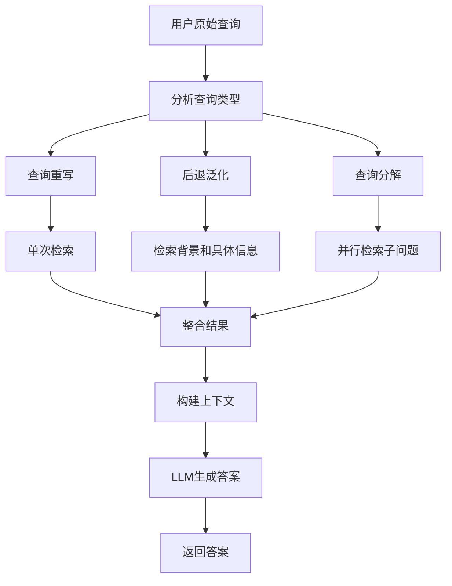

#### 💻 关键代码实现

```python
def rewrite_query(self, query: str) -> str:
    """策略1：重写查询，使其更明确和完整"""
    rewrite_prompt = f"""
    请改写以下查询，使其更清晰、明确和完整：

    原始查询：{query}

    改写要求：
    1. 添加必要的上下文和关键词
    2. 修正语法和表达
    3. 使意图更明确
    4. 保持简洁，不要过度扩展

    改写后的查询：
    """

    rewritten = self.llm_client.generate_text(rewrite_prompt)
    return rewritten.strip()

def generate_step_back_query(self, query: str) -> str:
    """策略2：生成后退式（更高层）的查询"""
    stepback_prompt = f"""
    对于以下具体问题，生成一个更高层次、更抽象的问题，
    以帮助获取背景知识和一般原理。

    具体问题：{query}

    示例：
    - 具体问题："为什么iPhone 13电池续航比iPhone 12长？"
    - 高层问题："智能手机电池技术的发展趋势是什么？"

    - 具体问题："如何在Python中实现快速排序？"
    - 高层问题："什么是排序算法及其分类？"

    高层问题：
    """

    stepback_query = self.llm_client.generate_text(stepback_prompt)
    return stepback_query.strip()

def decompose_query(self, query: str) -> List[str]:
    """策略3：将复杂查询分解为多个子问题"""
    decompose_prompt = f"""
    将以下复杂问题分解为3-5个更简单的子问题。
    每个子问题应该独立可答，且合在一起能完整回答原问题。

    复杂问题：{query}

    请以编号列表形式返回子问题：
    1. [子问题1]
    2. [子问题2]
    ...
    """

    response = self.llm_client.generate_text(decompose_prompt)

    # 解析子问题
    sub_queries = []
    for line in response.split('\n'):
        line = line.strip()
        if line and (line[0].isdigit() or line.startswith('-')):
            # 移除编号
            sub_query = line.split('.', 1)[-1].strip()
            sub_query = sub_query.lstrip('-').strip()
            if sub_query:
                sub_queries.append(sub_query)

    return sub_queries

def search_with_transformation(
    self,
    query: str,
    strategy: str = "auto",  # "rewrite", "stepback", "decompose", "auto"
    limit: int = 5
) -> Dict[str, Any]:
    """使用查询转换策略进行检索"""

    # 自动选择策略
    if strategy == "auto":
        strategy = self._select_strategy(query)

    if strategy == "rewrite":
        # 策略1：重写查询
        rewritten_query = self.rewrite_query(query)

        results = self.milvus_client.search_by_text(
            collection_name=self.collection_name,
            text=rewritten_query,
            limit=limit,
            output_fields=["text", "source"],
            metric_type="COSINE",
            embedding_client=self.embedding_client
        )

        return {
            "strategy": "rewrite",
            "original_query": query,
            "transformed_query": rewritten_query,
            "results": results
        }

    elif strategy == "stepback":
        # 策略2：后退式查询
        stepback_query = self.generate_step_back_query(query)

        # 先检索高层知识
        background_results = self.milvus_client.search_by_text(
            collection_name=self.collection_name,
            text=stepback_query,
            limit=limit,
            output_fields=["text", "source"],
            metric_type="COSINE",
            embedding_client=self.embedding_client
        )

        # 再检索具体信息
        specific_results = self.milvus_client.search_by_text(
            collection_name=self.collection_name,
            text=query,
            limit=limit,
            output_fields=["text", "source"],
            metric_type="COSINE",
            embedding_client=self.embedding_client
        )

        # 合并结果（去重）
        all_results = self._merge_results(background_results, specific_results)

        return {
            "strategy": "stepback",
            "original_query": query,
            "stepback_query": stepback_query,
            "results": all_results
        }

    elif strategy == "decompose":
        # 策略3：查询分解
        sub_queries = self.decompose_query(query)

        # 为每个子问题检索
        sub_results = []
        for sub_query in sub_queries:
            sub_result = self.milvus_client.search_by_text(
                collection_name=self.collection_name,
                text=sub_query,
                limit=limit,
                output_fields=["text", "source"],
                metric_type="COSINE",
                embedding_client=self.embedding_client
            )
            sub_results.append({
                "sub_query": sub_query,
                "results": sub_result
            })

        # 聚合所有结果
        all_results = self._aggregate_sub_results(sub_results)

        return {
            "strategy": "decompose",
            "original_query": query,
            "sub_queries": sub_queries,
            "sub_results": sub_results,
            "aggregated_results": all_results
        }

def _select_strategy(self, query: str) -> str:
    """自动选择最适合的转换策略"""
    selection_prompt = f"""
    为以下查询选择最合适的处理策略：

    查询：{query}

    策略选项：
    - rewrite: 查询表达不清晰，需要重写
    - stepback: 具体问题，需要背景知识
    - decompose: 复杂问题，包含多个方面

    只返回策略名称（rewrite/stepback/decompose）。
    """

    response = self.llm_client.generate_text(selection_prompt).strip().lower()

    if "decompose" in response:
        return "decompose"
    elif "stepback" in response:
        return "stepback"
    else:
        return "rewrite"

def query(self, question: str, strategy: str = "auto", limit: int = 3) -> str:
    """完整的Query Transform RAG流程"""
    # 1. 使用转换策略检索
    search_result = self.search_with_transformation(question, strategy, limit)

    # 2. 构建上下文
    if search_result["strategy"] == "decompose":
        # 分解策略：组织子问题的结果
        context_parts = []
        for sub_result in search_result["sub_results"]:
            sub_query = sub_result["sub_query"]
            context_parts.append(f"\n## {sub_query}")
            for i, result in enumerate(sub_result["results"][:2]):
                text = result['entity']['text']
                context_parts.append(f"{text[:200]}...")

        context = "\n\n".join(context_parts)

        # 要求LLM综合所有子问题的答案
        prompt = f"""
        原问题：{question}

        子问题及其相关信息：
        {context}

        请综合以上信息，完整回答原问题。
        """
    else:
        # Rewrite或Stepback策略：标准上下文
        results = search_result["results"]
        context = "\n\n".join([
            f"文档{i+1}:\n{r['entity']['text']}"
            for i, r in enumerate(results[:limit])
        ])
        prompt = f"上下文:\n{context}\n\n问题: {question}"

    # 3. 生成答案
    answer = self.llm_client.generate_text(
        prompt,
        system_instruction=self.system_prompt
    )

    return answer
```

#### 🔬 算法原理

1. **Query Rewrite原理**：

   - 增强查询的信息量
   - 添加同义词和相关词
   - 修正拼写和语法
   - 使意图更明确
2. **Step-back Prompting**：

   ```
   具体问题 → 抽象概念 → 背景知识 → 更好理解具体问题

   例如：
   "Python中列表推导式如何工作？"
   → Step-back: "什么是Python的语法糖和列表操作？"
   → 获取更全面的背景知识
   ```
3. **Query Decomposition**：

   ```
   复杂问题 = Sub-query1 + Sub-query2 + ... + Sub-queryN

   并行检索各子问题 → 聚合结果 → 综合回答

   例如：
   "比较Python和Java的性能、生态和学习曲线"
   → Sub1: "Python的性能特点"
   → Sub2: "Java的性能特点"
   → Sub3: "Python和Java的生态系统对比"
   → Sub4: "学习曲线对比"
   ```
4. **策略选择逻辑**：

   - **Rewrite**: 查询短、表达不清、关键词缺失
   - **Step-back**: 具体技术问题、需要原理性知识
   - **Decompose**: 包含"和"、"对比"、"分析"等关键词，明显是复合问题

#### ✅ 优点

- **提升检索质量**：优化后的查询更容易检索到相关文档
- **多角度覆盖**：特别是Decompose策略，全面覆盖问题
- **处理复杂查询**：能应对多方面、多层次的问题
- **灵活性强**：三种策略适应不同类型查询
- **背景知识**：Step-back提供更深层理解

#### ❌ 缺点

- **额外LLM调用**：每种策略都需要额外的LLM处理
- **延迟增加**：特别是Decompose需要多次检索
- **可能偏离**：转换后的查询可能偏离原意
- **复杂度高**：需要维护多种转换逻辑
- **成本增加**：更多的LLM调用和检索

#### 🎯 适用场景

- 用户查询表达不清晰
- 复杂的多方面问题
- 需要背景知识的技术问题
- 对比分析类问题
- 教育辅导系统
- 专业咨询助手

---

### 9. SemanticRag - 语义分块RAG

#### 📖 方法简介

SemanticRag使用语义分块技术，不再采用固定大小分块，而是基于句子之间的语义相似度动态确定分块边界。通过计算相邻句子嵌入向量的相似度，在语义突变点（相似度低的地方）进行切分，从而使每个chunk在语义上更加连贯完整。

#### 🎯 核心思想

- **语义连贯性**：按语义自然边界分块，而非机械的字数切割
- **动态断点**：基于句子相似度曲线找出语义跳变位置
- **完整性保护**：避免在语义紧密的句子中间切断
- **智能分割**：结合percentile阈值和最小chunk大小控制

#### 🔄 详细流程图

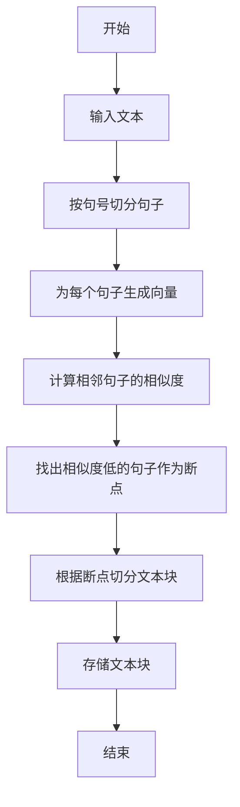

#### 💻 关键代码实现

```python
def _compute_breakpoints(self, sentences, embeddings):
    """计算语义断点"""
    if len(sentences) <= 1:
        return []

    # 1. 计算相邻句子的余弦相似度
    similarities = []
    for i in range(len(embeddings) - 1):
        sim = self._cosine_similarity(embeddings[i], embeddings[i+1])
        similarities.append(sim)

    # 2. 转换为语义距离（1 - 相似度）
    distances = [1 - sim for sim in similarities]

    # 3. 使用percentile确定阈值
    threshold = np.percentile(distances, self.breakpoint_percentile)

    # 4. 找出所有语义跳变点
    breakpoints = []
    current_chunk_size = 0

    for i, distance in enumerate(distances):
        current_chunk_size += len(sentences[i])

        # 条件：距离超过阈值 且 chunk大小足够
        if distance > threshold and current_chunk_size >= self.min_chunk_size:
            breakpoints.append(i + 1)
            current_chunk_size = 0

    return breakpoints

def _create_semantic_chunks(self, sentences, breakpoints):
    """根据断点创建chunk"""
    if not breakpoints:
        return [". ".join(sentences)]

    chunks = []
    start = 0

    for bp in breakpoints:
        chunk_text = ". ".join(sentences[start:bp])
        chunks.append(chunk_text)
        start = bp

    # 最后一个chunk
    if start < len(sentences):
        chunk_text = ". ".join(sentences[start:])
        chunks.append(chunk_text)

    return chunks
```

#### 🔬 算法原理

1. **句子Embedding**：

   ```
   每个句子 → Embedding向量 → 高维语义空间中的点
   ```
2. **语义距离计算**：

   ```
   相似度 = cosine_similarity(embedding_i, embedding_{i+1})
   语义距离 = 1 - 相似度

   距离大 → 语义跳变大 → 可能是分块边界
   距离小 → 语义连续 → 应保持在同一chunk
   ```
3. **动态阈值**：

   ```python
   threshold = np.percentile(distances, 80)  # 使用80分位数

   # 这意味着只有前20%最大的语义跳变才会被标记为断点
   ```
4. **最小chunk约束**：

   - 避免产生过小的chunk（信息不完整）
   - 即使语义跳变，也需满足最小大小要求

#### ✅ 优点

- **语义完整性**：每个chunk在语义上更连贯
- **自然边界**：在主题或段落转换处分割
- **灵活适应**：自动适应文档的语义结构
- **检索精度高**：语义完整的chunk更容易匹配查询
- **减少信息碎片**：避免在句子中间或段落中间切断

#### ❌ 缺点

- **计算开销大**：需要为每个句子生成embedding
- **处理速度慢**：相似度计算的复杂度为O(n)
- **不适合长句**：句子本身很长时分块仍然困难
- **依赖句子质量**：标点符号错误会影响分句
- **可能不均匀**：有些chunk可能很大，有些很小

#### 🎯 适用场景

- 长文档或书籍章节
- 主题明确且有清晰段落结构的文档
- 学术论文（有明显的章节转换）
- 新闻文章（段落主题变化明显）
- 需要保持语义完整性的应用

---

### 10. HierarchyRAG - 层次化检索RAG

#### 📖 方法简介

HierarchyRAG实现了两级检索策略：第一级搜索页面/文档级别的摘要，第二级在找到的相关页面内搜索详细的文本块。这种层次化结构模拟了人类查找信息的方式——先找到相关章节，再在章节内细读。

#### 🎯 核心思想

- **两级索引**：粗粒度摘要 + 细粒度chunks
- **先粗后细**：先定位大致范围，再精确检索
- **上下文感知**：chunks携带其所属页面的信息
- **分步过滤**：减少无关chunk的干扰

#### 🔄 详细流程图

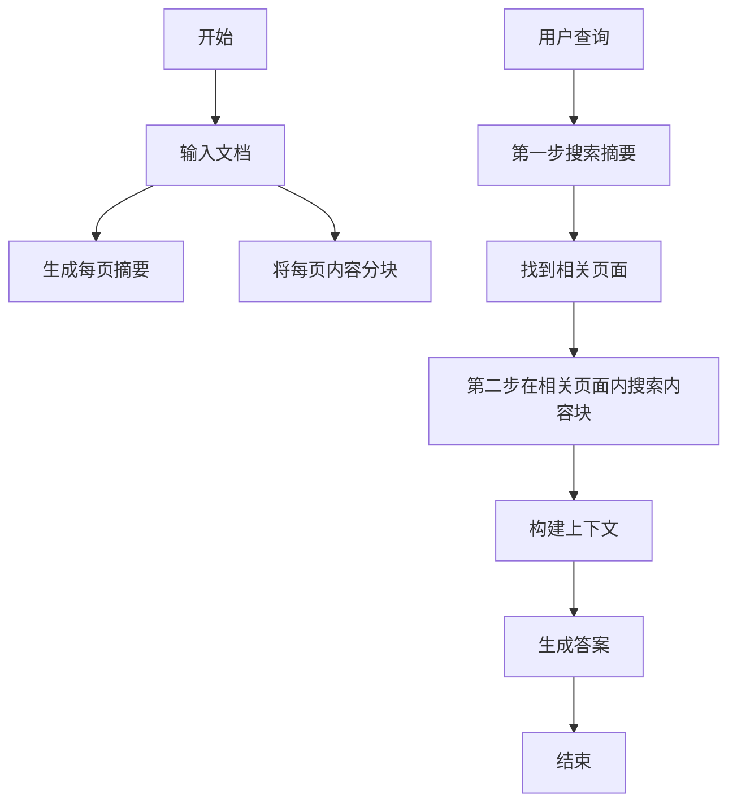

#### 💻 关键代码实现

```python
def generate_page_summary(self, text, page_num):
    """生成页面摘要"""
    # 1. 使用LLM总结页面内容
    prompt = f"""
    请用2-3句话总结以下内容的核心主题和关键信息：

    {text[:2000]}  # 取前2000字符
    """

    summary = self.llm_client.generate_text(
        prompt,
        system_instruction="你是一个专业的文档摘要助手"
    )

    # 2. 生成摘要的embedding
    summary_embedding = self.embed_model.encode([summary])[0]

    # 3. 存储到summaries collection
    self.summaries_collection.insert([{
        "vector": summary_embedding,
        "page_num": page_num,
        "summary": summary,
        "text": text
    }])

    return summary

def hierarchical_search(self, query, top_k_pages=3, top_k_chunks=5):
    """层次化搜索"""
    # 第1级：搜索页面摘要
    query_embedding = self.embed_model.encode([query])[0]

    summary_results = self.summaries_collection.search(
        data=[query_embedding],
        anns_field="vector",
        param={"metric_type": "COSINE"},
        limit=top_k_pages,
        output_fields=["page_num", "summary"]
    )[0]

    # 提取相关页面编号
    relevant_pages = [r.entity.get("page_num") for r in summary_results]

    print(f"第1级：找到相关页面 {relevant_pages}")

    # 第2级：在相关页面的chunks中搜索
    # 构建过滤表达式
    page_filter = f"page_num in {relevant_pages}"

    chunk_results = self.chunks_collection.search(
        data=[query_embedding],
        anns_field="vector",
        param={"metric_type": "COSINE"},
        limit=top_k_chunks * len(relevant_pages),
        output_fields=["text", "page_num", "page_summary"],
        expr=page_filter  # 只搜索相关页面的chunks
    )[0]

    return chunk_results
```

#### 🔬 算法原理

1. **两级索引结构**：

   ```
   Level 1: 页面摘要索引
   ├─ Summary 1 (Page 1-5) → Embedding_1
   ├─ Summary 2 (Page 6-10) → Embedding_2
   └─ Summary 3 (Page 11-15) → Embedding_3

   Level 2: Chunk详细索引
   ├─ Chunk 1.1 (Page 1) → Embedding_1.1
   ├─ Chunk 1.2 (Page 1) → Embedding_1.2
   └─ ...
   ```
2. **检索流程**：

   ```
   Query → Embed → Search Level 1 → Get Page IDs
                                    ↓
                          Filter Level 2 by Page IDs
                                    ↓
                            Search in Filtered Chunks
   ```
3. **信息增强**：

   ```python
   chunk_data = {
       "text": chunk_text,           # chunk本身的文本
       "page_num": page_num,          # 所属页面
       "page_summary": summary,       # 页面摘要（增强上下文）
       "vector": chunk_embedding
   }
   ```
4. **减少搜索空间**：

   - 不搜索：在100,000个chunks中直接搜索
   - 而是：先在1,000个页面摘要中找3个 → 再在300个chunks中搜索
   - 搜索效率提升显著

#### ✅ 优点

- **检索效率高**：两级过滤大幅减少搜索空间
- **准确性提升**：先定位大致范围再精确搜索
- **上下文丰富**：chunk携带页面摘要信息
- **可扩展性好**：适用于大规模文档库
- **结构清晰**：符合人类检索逻辑

#### ❌ 缺点

- **依赖摘要质量**：第1级错误会影响整体
- **跨页面信息**：难以处理跨页面的关联信息
- **额外LLM调用**：生成摘要需要额外成本
- **存储开销**：需要维护两个collection
- **页面划分**：需要合理的页面/章节划分

#### 🎯 适用场景

- 大型文档库或知识库
- 书籍、手册、技术文档
- 有明确章节结构的内容
- 多文档问答系统
- 企业内部知识管理
- 法律文档检索

---

### 11. ContextualCompressionRAG - 上下文压缩RAG

#### 📖 方法简介

ContextualCompressionRAG使用LLM对检索到的chunks进行智能压缩和过滤，只保留与查询直接相关的部分。通过三种压缩策略（selective、summary、extraction），去除无关信息，减少噪声，提升生成质量。

#### 🎯 核心思想

- **智能过滤**：LLM判断并保留相关内容
- **噪声消除**：去除与查询无关的句子和段落
- **上下文精简**：减少输入token，提高效率
- **三种策略**：选择性保留、摘要提取、关键信息抽取

#### 🔄 详细流程图

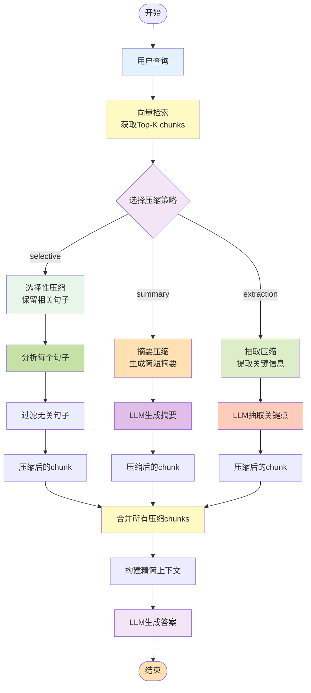

#### 💻 关键代码实现

```python
def compress_chunk(self, chunk_text, query, compression_type="selective"):
    """压缩单个chunk"""

    if compression_type == "selective":
        # 选择性压缩：保留相关句子
        prompt = f"""
        查询：{query}

        文本：{chunk_text}

        请只保留与查询直接相关的句子，删除无关内容。
        以JSON格式返回：{{"relevant_sentences": ["句子1", "句子2", ...]}}
        """

        response = self.llm_client.generate_text(prompt)
        relevant = json.loads(response)["relevant_sentences"]
        compressed = " ".join(relevant)

    elif compression_type == "summary":
        # 摘要压缩：生成简短摘要
        prompt = f"""
        查询：{query}

        文本：{chunk_text}

        请针对查询，用1-2句话总结文本中的相关信息。
        """

        compressed = self.llm_client.generate_text(prompt)

    elif compression_type == "extraction":
        # 抽取压缩：提取关键信息点
        prompt = f"""
        查询：{query}

        文本：{chunk_text}

        请提取文本中与查询相关的关键信息点，用简洁的要点列出。
        """

        compressed = self.llm_client.generate_text(prompt)

    return compressed
```

#### 🔬 算法原理

1. **三种压缩策略对比**：

   **Selective（选择性）**：

   ```
   原文：句子A（相关）。句子B（无关）。句子C（相关）。句子D（无关）。
   压缩后：句子A。句子C。
   ```

   **Summary（摘要）**：

   ```
   原文：详细描述了Python的列表操作，包括append、extend、insert等方法...（500字）
   压缩后：Python列表支持多种操作方法如append和extend。
   ```

   **Extraction（抽取）**：

   ```
   原文：混杂的段落...
   压缩后：
   - 要点1：xxx
   - 要点2：yyy
   - 要点3：zzz
   ```
2. **Token节省**：

   ```
   原始Top-10 chunks: 5000 tokens
   压缩后: 1500 tokens

   节省60%，但保留了核心信息
   ```

#### ✅ 优点

- **减少噪声**：过滤无关信息，提高答案质量
- **节省Token**：减少输入长度，降低成本
- **提升精度**：LLM能更聚焦于相关信息
- **灵活策略**：三种压缩方式适应不同需求

#### ❌ 缺点

- **额外LLM调用**：每个chunk都需要压缩处理
- **延迟增加**：多次LLM调用导致响应变慢
- **成本高昂**：大量chunk压缩会显著增加成本
- **信息丢失风险**：压缩可能删除有用信息

#### 🎯 适用场景

- Chunk普遍较长且包含大量无关信息
- 对答案精度要求极高的场景
- Token成本敏感的应用
- 技术文档问答
- 法律文档分析

---

### 12. ContextEnrichedRAG - 上下文增强RAG

#### 📖 方法简介

ContextEnrichedRAG在检索到最相关的chunk后，会自动获取该chunk前后相邻的chunks，将它们一起作为上下文提供给LLM。这种方式增强了上下文的连贯性和完整性，避免信息被截断。

#### 🎯 核心思想

- **上下文连续性**：不只看孤立的chunk，还看前后文
- **信息完整性**：避免关键信息恰好被切割在chunk边界
- **窗口扩展**：以匹配chunk为中心向两边扩展
- **自然过渡**：提供更自然的阅读体验

#### 🔄 详细流程图

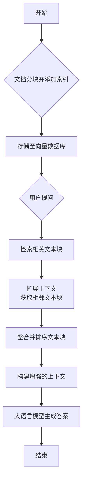

#### 💻 关键代码实现

```python
def context_enriched_search(self, query, top_k=3, context_window=1):
    """上下文增强检索"""
    # 1. 标准检索
    query_embedding = self.embed_model.encode([query])[0]

    results = self.collection.search(
        data=[query_embedding],
        anns_field="vector",
        param={"metric_type": "COSINE"},
        limit=top_k,
        output_fields=["text", "chunk_index", "total_chunks", "file_path"]
    )[0]

    # 2. 为每个匹配chunk收集上下文
    enriched_chunks = []
    seen_indices = set()

    for result in results:
        chunk_index = result.entity.get("chunk_index")

        # 计算扩展范围
        start_index = max(0, chunk_index - context_window)
        end_index = min(total_chunks - 1, chunk_index + context_window)

        # 获取扩展范围内的所有chunks
        for idx in range(start_index, end_index + 1):
            if idx not in seen_indices:
                seen_indices.add(idx)
                # 查询特定索引的chunk
                chunk_result = self.collection.query(
                    expr=f"chunk_index == {idx}",
                    output_fields=["text", "chunk_index"]
                )
                if chunk_result:
                    enriched_chunks.append({
                        "text": chunk_result[0]["text"],
                        "index": idx,
                        "is_matched": (idx == chunk_index)
                    })

    # 3. 按原文顺序排序
    enriched_chunks.sort(key=lambda x: x["index"])
    return enriched_chunks
```

#### 🔬 算法原理

1. **上下文窗口机制**：

   ```
   文档切分：[Chunk0] [Chunk1] [Chunk2] [Chunk3] [Chunk4] [Chunk5]

   检索结果：Chunk2 最匹配

   Context Window = 1:
   返回：[Chunk1] [Chunk2*] [Chunk3]

   Context Window = 2:
   返回：[Chunk0] [Chunk1] [Chunk2*] [Chunk3] [Chunk4]
   ```
2. **完整性保障**：
   避免关键信息被chunk边界切断，提供完整上下文。

#### ✅ 优点

- **上下文连贯**：提供更自然、完整的阅读体验
- **信息完整性**：避免关键信息被chunk边界切断
- **实现简单**：只需添加索引和扩展逻辑
- **灵活调节**：可调整context_window大小

#### ❌ 缺点

- **可能引入噪声**：相邻chunks可能包含无关信息
- **Token增加**：扩展上下文会增加输入长度
- **严格顺序依赖**：要求chunks按原文顺序存储
- **跨文档限制**：不适用于多文档混合检索

#### 🎯 适用场景

- 长文档或连续性强的文本
- 技术教程和文档（步骤连续）
- 小说、故事（情节连贯）
- 代码文档（上下文依赖）
- 会议记录和报告

---

### 13. ContextualChunkProcessor - 上下文标题RAG

#### 📖 方法简介

ContextualChunkProcessor为每个chunk生成一个描述性的标题（header），该标题概括了chunk的主题和内容。在检索时，使用双向量策略：既搜索chunk文本的embedding，也搜索header的embedding，从而提升检索的主题匹配度。

#### 🎯 核心思想

- **双向量索引**：text_vector + header_vector
- **主题增强**：header明确chunk的主题
- **双重匹配**：文本匹配 + 主题匹配

#### ✅ 优点

- **主题匹配增强**：不只靠关键词，还考虑主题相关性
- **检索召回率高**：双向量增加匹配机会
- **语义理解更深**：header提供抽象层面的理解

#### ❌ 缺点

- **Header生成成本**：每个chunk都需要LLM调用
- **存储开销**：需要存储两个向量字段
- **检索复杂度**：需要执行两次向量搜索

#### 🎯 适用场景

- 技术文档（章节主题明确）
- 新闻文章检索
- 学术论文检索
- 产品手册和FAQ

---

### 14. DocumentAugmentationRAG - 文档增强RAG

#### 📖 方法简介

DocumentAugmentationRAG为每个chunk生成多个相关问题，并将这些问题与chunk一起索引。检索时，同时搜索chunk文本和生成的问题，从而提高问答场景下的检索准确性。

#### 🎯 核心思想

- **反向问题生成**：从答案（chunk）生成问题
- **问题索引**：将生成的问题也纳入检索范围
- **问答对齐**：用户问题更容易匹配生成的问题
- **多角度覆盖**：一个chunk对应多个潜在问题

#### ✅ 优点

- **问答对齐**：用户问题与生成问题高度对齐
- **召回率提升**：多个问题角度增加匹配机会
- **语义泛化**：不同表达方式的问题都能匹配
- **适合FAQ**：天然适合问答场景

#### ❌ 缺点

- **生成成本高**：每个chunk都需要生成问题
- **问题质量依赖**：依赖LLM生成高质量问题
- **存储开销大**：需要存储额外的问题数据

#### 🎯 适用场景

- FAQ系统、客服机器人、在线帮助文档
- 技术支持系统、教育问答平台

---

### 15. FeedbackLoopRAG - 反馈循环RAG

#### 📖 方法简介

FeedbackLoopRAG引入用户反馈机制，根据用户对检索结果的评价（有用/无用）动态调整相关性分数。通过持续学习用户偏好，逐步提升检索质量。

#### 🎯 核心思想

- **用户反馈**：收集用户对检索结果的评价
- **动态调整**：根据反馈调整chunk的相关性分数
- **持续学习**：累积反馈数据优化检索策略
- **个性化**：学习特定用户或场景的偏好

#### ✅ 优点

- **持续改进**：随着使用不断优化
- **个性化**：学习特定场景的偏好
- **简单有效**：实现简单但效果明显
- **用户参与**：增强用户参与感

#### ❌ 缺点

- **冷启动问题**：初期无反馈数据
- **反馈稀疏**：用户不一定愿意提供反馈
- **反馈偏差**：可能存在用户偏见

#### 🎯 适用场景

- 企业内部知识库（用户群体固定）
- 客服系统（高频使用场景）
- 专业领域问答（专家反馈）
- 长期运营的RAG系统

---

### 16. RSERAG - 相关段落提取RAG

#### 📖 方法简介

RSERAG使用最大子数组算法（类似股票买卖问题）来找到文档中最相关的连续段落。不是单独评估每个chunk，而是寻找"累积相关性"最高的连续chunk序列，确保上下文连贯且高度相关。

#### 🎯 核心思想

- **连续性优化**：寻找最优的连续chunk序列
- **累积相关性**：考虑chunk序列的整体价值
- **动态规划**：使用Kadane算法变体
- **上下文完整**：自然保持上下文连贯性

#### 🔬 算法原理

使用最大子数组算法（Kadane's Algorithm）：

#### ✅ 优点

- **连续性保证**：自动保持chunk的连贯性
- **整体优化**：全局最优段落而非局部最优
- **算法高效**：O(n)时间复杂度
- **上下文完整**：天然包含前后文信息
- **自适应长度**：根据相关性动态确定段落长度

#### ❌ 缺点

- **严格顺序依赖**：要求chunks严格按原文顺序
- **阈值敏感**：threshold参数需要仔细调优
- **单段落限制**：只返回一个最佳段落
- **不适合跳跃式信息**：相关信息分散时效果差

#### 🎯 适用场景

- 长文档阅读理解
- 连续性强的文本（小说、报告）
- 需要完整段落的应用
- 技术文档（步骤连续）
- 避免碎片化信息的场景

---

## 第三部分：对比分析与选择指南

### 🎯 技术特性对比

#### 分块策略分类

| 策略类型             | 方法                                                      | 特点                           |
| -------------------- | --------------------------------------------------------- | ------------------------------ |
| **固定分块**   | SimpleRAG, AdaptiveRAG, HyDERAG, CRAG, SelfRAG, RerankRAG | 简单高效，适合大多数场景       |
| **语义分块**   | SemanticRag                                               | 保持语义完整性，适合结构化文档 |
| **层次分块**   | HierarchyRAG                                              | 多级检索，适合大规模文档       |
| **上下文扩展** | ContextEnrichedRAG, RSERAG                                | 包含前后文，适合连续文本       |

#### 检索策略分类

| 策略类型             | 方法                            | 优势                        |
| -------------------- | ------------------------------- | --------------------------- |
| **单向量检索** | SimpleRAG, AdaptiveRAG, HyDERAG | 速度快，成本低              |
| **双向量检索** | ContextualChunkProcessor        | 文本+主题双重匹配           |
| **混合检索**   | FusionRAG                       | BM25+向量，覆盖关键词和语义 |
| **重排序**     | RerankRAG                       | 两阶段检索，精度提升        |
| **层次检索**   | HierarchyRAG                    | 先粗后细，效率高            |

#### 优化策略分类

| 策略类型             | 方法                                         | 核心技术             |
| -------------------- | -------------------------------------------- | -------------------- |
| **查询优化**   | HyDERAG, QueryTransformRAG                   | 查询重写、分解、扩展 |
| **结果优化**   | CRAG, SelfRAG                                | 相关性评估、自我反思 |
| **上下文优化** | ContextualCompressionRAG, ContextEnrichedRAG | 压缩、扩展           |
| **索引优化**   | DocumentAugmentationRAG                      | 生成问题增强索引     |
| **反馈优化**   | FeedbackLoopRAG                              | 用户反馈持续改进     |

### 🔍 场景选择决策树

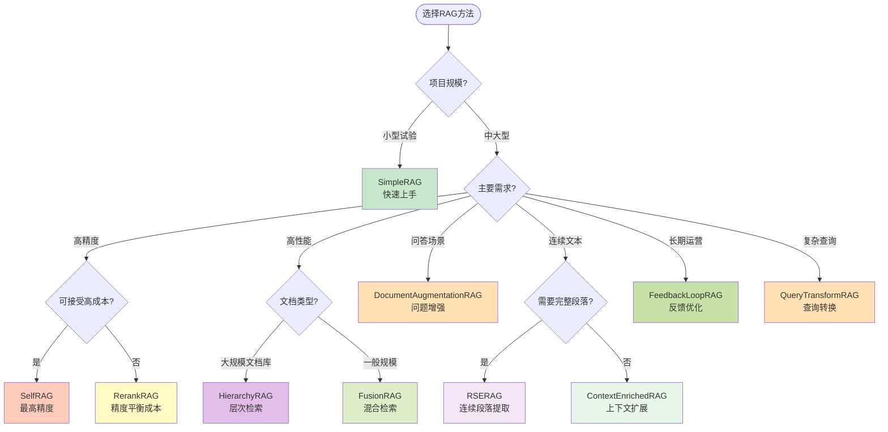

### 💡 组合使用建议

很多RAG方法可以组合使用，发挥协同效应：

1. **高精度组合**：

   - FusionRAG (混合检索) + RerankRAG (重排序) + ContextualCompressionRAG (压缩)
   - 适合：对答案质量要求极高的场景
2. **高性能组合**：

   - HierarchyRAG (层次检索) + ContextEnrichedRAG (上下文扩展)
   - 适合：大规模文档库的快速检索
3. **平衡组合**：

   - AdaptiveRAG (自适应分类) + RerankRAG (重排序)
   - 适合：多样化查询类型的通用场景
4. **FAQ专用组合**：

   - DocumentAugmentationRAG (问题生成) + FeedbackLoopRAG (反馈优化)
   - 适合：客服系统和FAQ场景
5. **长文本组合**：

   - SemanticRag (语义分块) + RSERAG (段落提取) + ContextEnrichedRAG (上下文扩展)
   - 适合：书籍、长报告等连续文本

---

## 第四部分：实践建议

### 🚀 快速开始指南

#### 新手路径（0-1个月）

1. **第1周：基础入门**

   - 实现并理解 SimpleRAG
   - 掌握向量数据库基本操作（Milvus/Pinecone）
   - 理解Embedding原理和应用
2. **第2周：优化尝试**

   - 尝试 RerankRAG 或 FusionRAG
   - 学习评估指标（准确率、召回率、F1）
   - 对比不同分块策略的效果
3. **第3-4周：高级方法**

   - 根据具体场景选择1-2个高级方法实践
   - 学习参数调优（chunk_size, top_k, temperature）
   - 建立自己的评估测试集

#### 进阶路径（1-3个月）

1. **深入理解**

   - 研究 SelfRAG 和 CRAG 的评估机制
   - 学习查询转换技术（HyDE, Query Rewriting）
   - 掌握混合检索策略
2. **性能优化**

   - 学习缓存策略减少LLM调用
   - 批处理优化embedding生成
   - 异步处理提升响应速度
3. **生产部署**

   - 实现监控和日志系统
   - A/B测试不同RAG方法
   - 建立反馈循环机制

### ⚙️ 参数调优指南

#### 核心参数说明

| 参数                    | 推荐范围 | 影响                     | 调优建议                          |
| ----------------------- | -------- | ------------------------ | --------------------------------- |
| **chunk_size**    | 200-1000 | 上下文完整性 vs 检索精度 | 技术文档200-500，叙事文本500-1000 |
| **chunk_overlap** | 50-200   | 边界信息完整性           | 一般设为chunk_size的20-30%        |
| **top_k**         | 3-10     | 检索召回 vs 噪声         | 开始用5，根据准确率调整           |
| **temperature**   | 0.0-0.7  | 生成稳定性 vs 创造性     | 事实性问答用0.0-0.3               |
| **rerank_top_n**  | 2-5      | 重排序精度               | 通常为top_k的1/2                  |

#### 分块策略选择

```python
# 1. 技术文档/代码：小chunk + 高overlap
chunk_size = 300
overlap = 100

# 2. 新闻/文章：中等chunk + 中等overlap
chunk_size = 500
overlap = 100

# 3. 书籍/长文本：大chunk + 低overlap
chunk_size = 800
overlap = 150

# 4. FAQ/短文本：小chunk + 无overlap
chunk_size = 200
overlap = 0
```

### 🐛 常见问题与解决方案

#### 问题1：检索结果不相关

**可能原因**：

- Embedding模型不适合领域
- chunk_size设置不当
- top_k过大引入噪声

**解决方案**：

1. 使用领域特定的Embedding模型
2. 调整chunk_size（减小通常能提升精度）
3. 减小top_k或添加重排序
4. 尝试HyDERAG或QueryTransformRAG优化查询

#### 问题2：答案截断或不完整

**可能原因**：

- chunk在关键信息处切断
- 检索的chunk不包含完整答案

**解决方案**：

1. 增加chunk_overlap
2. 使用ContextEnrichedRAG扩展上下文
3. 使用SemanticRag语义分块
4. 使用RSERAG获取连续段落

#### 问题3：响应速度慢

**可能原因**：

- 向量检索耗时
- LLM生成耗时
- 多次LLM调用（SelfRAG, CRAG）

**解决方案**：

1. 使用HierarchyRAG减少检索范围
2. 实现查询缓存
3. 批处理embedding生成
4. 使用更快的LLM模型
5. 异步处理非关键路径

#### 问题4：成本过高

**可能原因**：

- 频繁的LLM调用
- 大量的embedding生成
- 使用昂贵的模型

**解决方案**：

1. 实现多级缓存（查询缓存、embedding缓存）
2. 使用ContextualCompressionRAG减少token
3. 批处理优化API调用
4. 选择性使用高级方法（仅对重要查询使用SelfRAG）
5. 考虑开源模型

### 📈 评估与监控

#### 关键指标

1. **检索质量指标**：

   - Precision@K：前K个结果中相关的比例
   - Recall@K：相关结果被检索到的比例
   - MRR (Mean Reciprocal Rank)：第一个相关结果的平均排名倒数
   - NDCG：考虑排序的累积增益
2. **生成质量指标**：

   - 事实准确性：答案是否基于检索内容
   - 完整性：是否回答了问题的所有方面
   - 相关性：是否切题
   - 流畅性：语言是否自然
3. **系统性能指标**：

   - 响应延迟（P50, P95, P99）
   - API调用次数和成本
   - 缓存命中率
   - 系统吞吐量

#### 评估方法

```python
# 1. 构建评估数据集
eval_dataset = [
    {
        "query": "Python如何处理异常？",
        "ground_truth": "使用try-except语句...",
        "relevant_docs": ["doc_123", "doc_456"]
    },
    # ... 更多样本（建议至少100个）
]

# 2. 运行评估
for sample in eval_dataset:
    # 检索评估
    retrieved_docs = rag.search(sample["query"])
    precision = calculate_precision(retrieved_docs, sample["relevant_docs"])
    recall = calculate_recall(retrieved_docs, sample["relevant_docs"])

    # 生成评估
    answer = rag.query(sample["query"])
    factuality = evaluate_factuality(answer, retrieved_docs)
    relevance = evaluate_relevance(answer, sample["query"])
```
